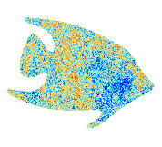

.. CosmicFish documentation master file, created by
   sphinx-quickstart on Mon Jan 25 15:36:29 2016.
   You can adapt this file completely to your liking, but it should at least
   contain the root `toctree` directive.

*************************
CosmicFish Python library
*************************

This is the documentation for the CosmicFish Python library.

This Python package is meant to have all the relevant tools to analyse and plot Fisher matrices.

.. toctree::
   :maxdepth: 1

   Introduction <introduction>
   Examples and tutorial <example.html#://>
   Live examples and tutorial <http://mybinder.org/repo/cosmicfish/cosmicfish>

There are also some applications already implemented:

.. toctree::
   :maxdepth: 1

   Applications <cosmicfish_pylib_apps>

Content of the library:

.. toctree::
   :maxdepth: 1

   cosmicfish_pylib_colors
   cosmicfish_pylib_fisher_derived
   cosmicfish_pylib_fisher_matrix
   cosmicfish_pylib_fisher_operations
   cosmicfish_pylib_fisher_plot_settings
   cosmicfish_pylib_fisher_plot
   cosmicfish_pylib_fisher_plot_analysis
   cosmicfish_pylib_utilities
   cosmicfish_todo

Indices and tables
==================

* :ref:`genindex`
* :ref:`modindex`
